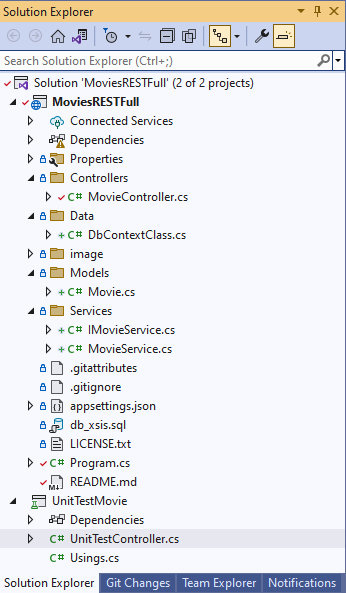
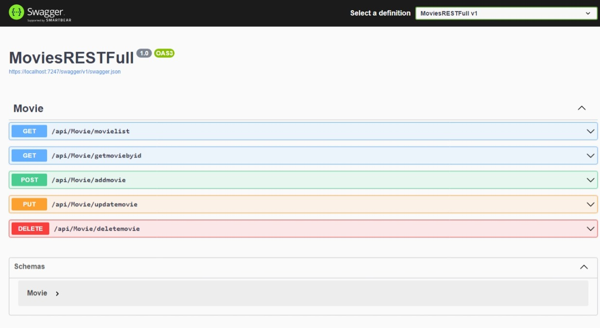
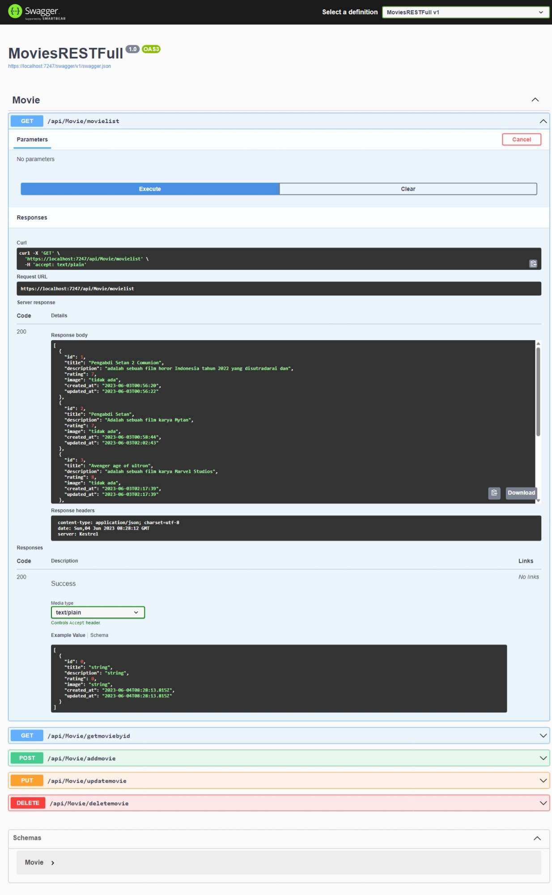
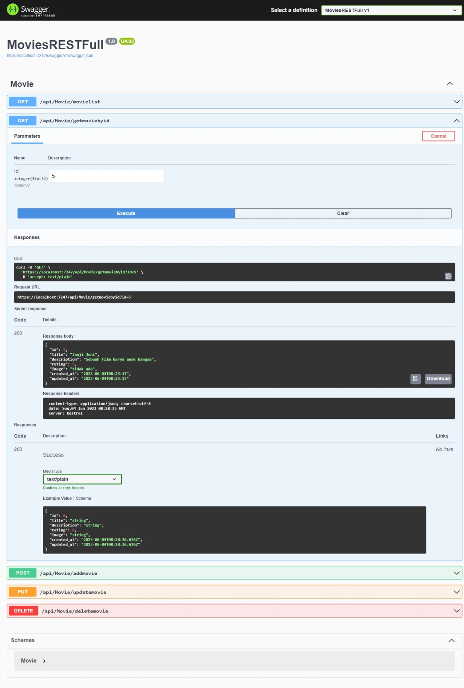
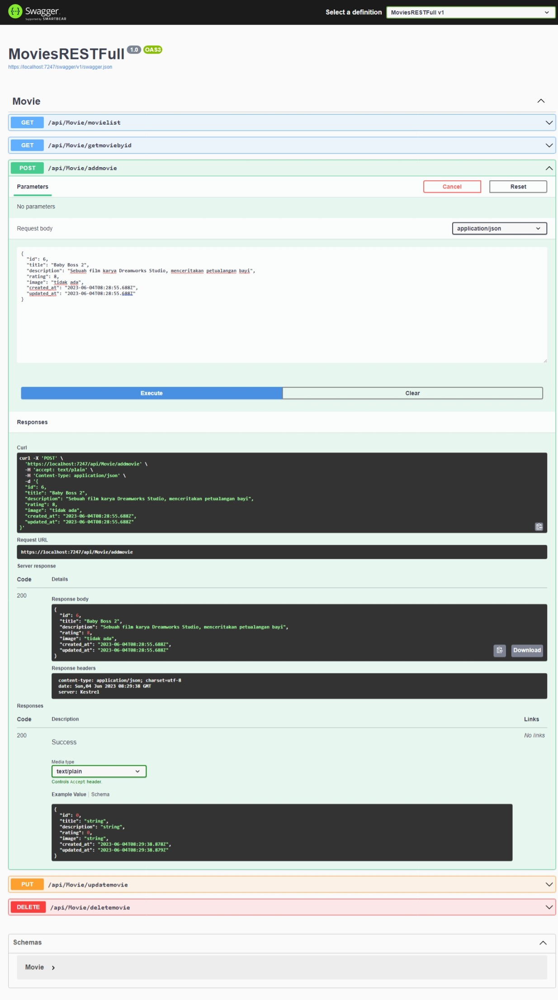
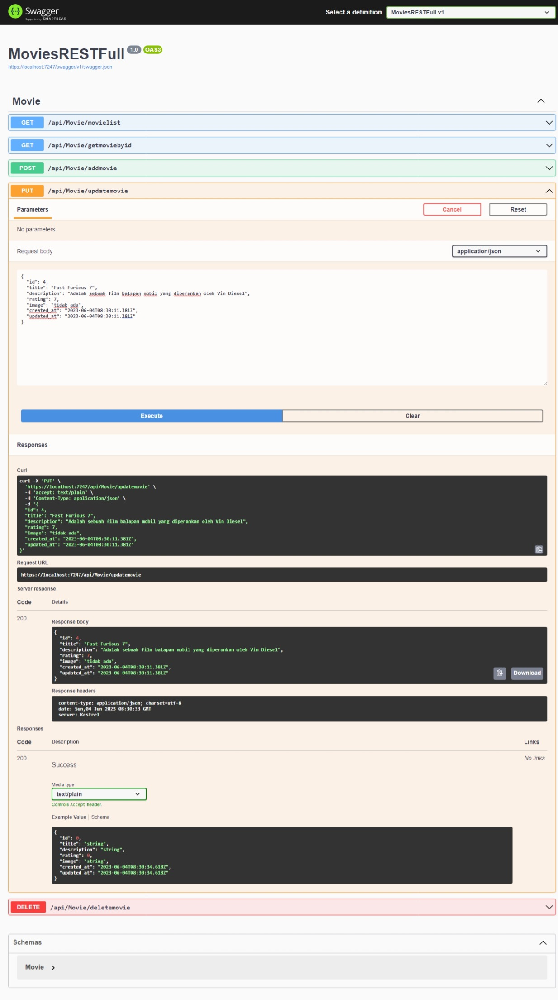
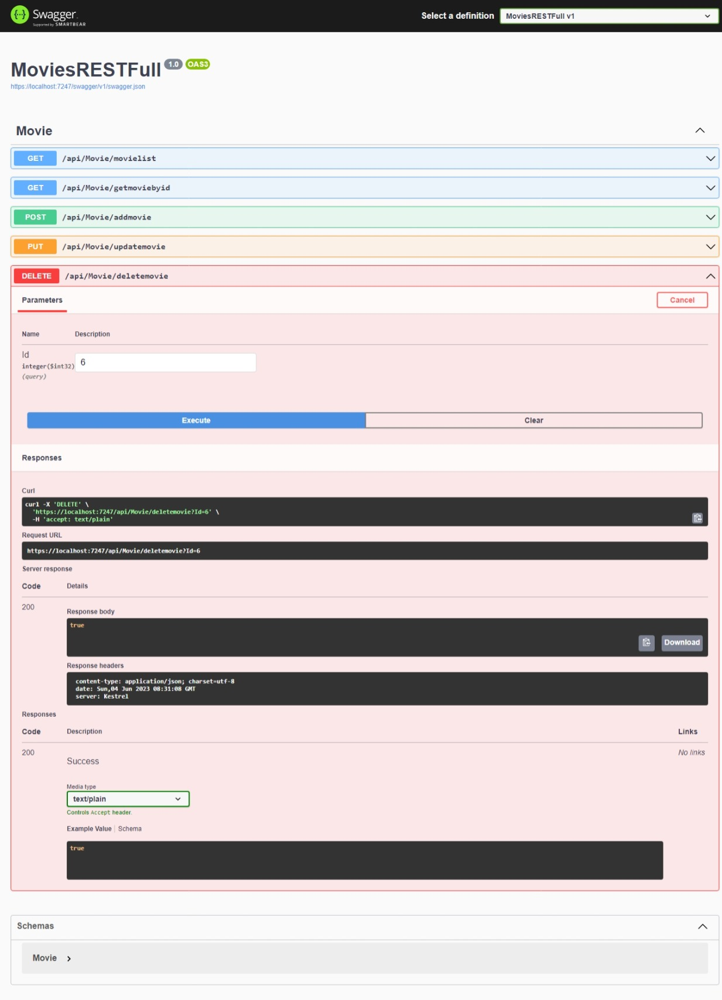
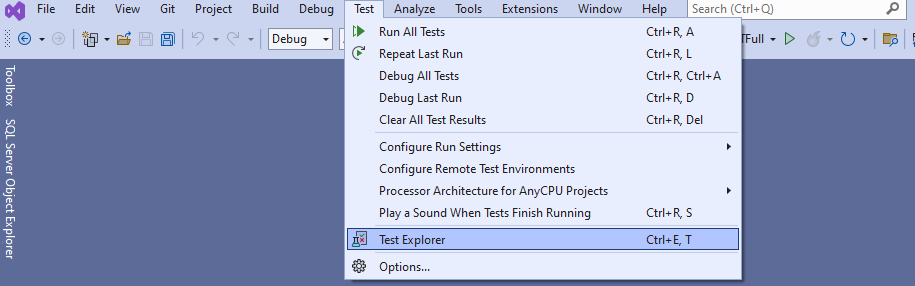
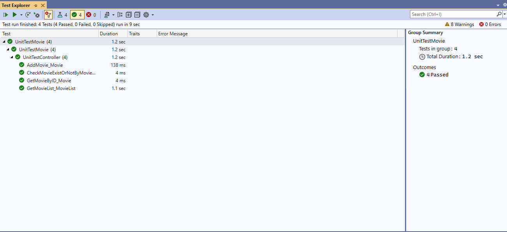

# MoviesRESTFull

## Tentang Project
### Deskripsi
*Adalah RESTFull API yang dibuat untuk memenuhi syarat Reqruitment di PT Xsis Mitra Utama*

### Framework, Library dan Database
*MoviesRESTFull dibangun dengan ASP.NET Core Web API dengan Framework .NET 6.0 dan MySQL*

Ada 2 Project dalam pembuatan RESTFull ini :
* MovieRESTFull
* UnitTestMovie (di dalam zip file)



Beberapa library yang digunakan, diantaranya :
* Microsoft.AspNet.WebApi.Core
* Microsoft.EntityFrameworkCore.Design
* Microsoft.EntityFrameworkCore.Tools
* MySql.EntityFrameworkCore
* Swashbuckle.AspNetCore
* Moq

Versi Database : MySQL versi 5.7.36

*Table* : **Movie**

| Columns     | Type        | Length | Primary |
| ----------- | ----------- | ------ | ------- |
| id          | int         | 11     | YES     |
| title       | varchar     | 50     |         |
| description | varchar     | 1000   |         |
| rating      | float       |        |         |
| image       | varchar     | 50     |         |
| created_at  | datetime    |        |         |
| updated_at  | datetime    |        |         |

**unit test dalam project ini menggunakan xUnit**

# Memulai
## Requirement/Kebutuhan
Untuk Requierement/Kebutuhan dalam menjalankan REST API ini, diantaranya :
* Visual Studio 2022.
* Web Server seperti XAMPP, WAMPP dan sebagainya.
* SQL Editor seperti PhpMyAdmin, HeidiSQL dan sebagainya.

## Cara Install
Untuk dapat menggunakan RESTFull API ini adalah sebagai berikut :
* Buka Visual Studio anda
* Pilih menu Tools => NuGet Package Manager => Package Manager Console
* Lalu Clone repo dengan mengetik perintah/command `git clone https://github.com/yb6241/MoviesRESTFull.git`
* Buka SQL editor anda
* kemudian restore database db_xsis.sql dengan menggunakan nama yang sama `db_xsis`
* Untuk merubah koneksi database dapat dikonfigurasi pada file `appsettings.json`
```json
"ConnectionStrings": {
    "DefaultConnection": "server=127.0.0.1;port=3306;user=root;password=;database=db_xsis;"
  }
```
* Jalankan aplikasi dengan menekan `F5`
* Aplikasi akan otomatis membuka Swagger editor
* Anda juga bisa menggunakan aplikasi pihak ketiga seperti Postman

# Contoh Penggunaan


## Get
`api/Movie/movielist`



## Get by ID
`api/Movie/getmoviebyid`



## Post
`api/Movie/addmovie`



## Put
`api/Movie/updatemovie`



## Delete
`api/Movie/deletemovie/{Id}`



# Cara menggunakan Unit Test dalam Projek ini
* Unzip file UnitTestMovie
* Buka Test Explorer



* Kemudian Klik Run 



* Dan perhatikan ada 4 test case, jika berhasil maka semuanya akan muncul status passes

# Cara Berkontribusi
Untuk bisa berkontribusi dalam mengembangkan aplikasi ini, silahkan kontak developer terlebih dahulu.

# Lisensi
Lisensi yang digunakan GNU GENERAL PUBLIC LICENSE Version 3

Anda bisa melihatnya pada file `LICENSE.txt`

# Kontak
- Phone : +62 896 3696 7361
- Email : yanbaktra@gmail.com